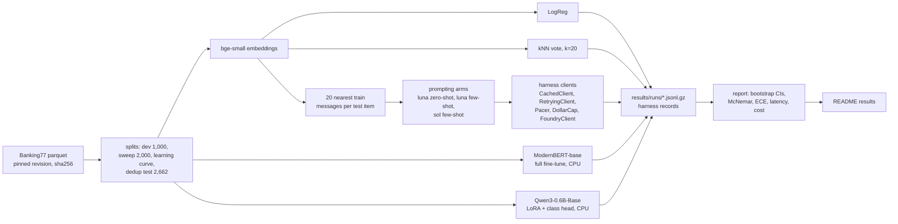

# banking77-lora-vs-frontier

A 0.6B open model with a LoRA classification head, trained on a 4-core CPU, against prompting frontier API models (gpt-6-luna, gpt-6-sol) on Banking77 intent classification.
Every arm is scored on the same 3,080 test messages with accuracy, macro-F1, paired significance tests, latency and cost per 1,000 predictions.

## Results

`make demo` rebuilds this section from the committed run files in `results/`. It needs no keys and no models. Rows marked pending have not been run yet: the long CPU training runs and the paid API runs are started separately (see [Running everything](#running-everything)). No number here is estimated or copied from elsewhere.

<!-- results:start -->
| Arm | Accuracy (95% CI) | Macro-F1 (95% CI) | Accuracy, dedup test (n=2,662) | ECE | Latency p50 / p95 | Cost per 1k predictions |
|---|---|---|---|---|---|---|
| LogReg on bge-small embeddings | 93.4% (92.5 to 94.3) | 93.4% (92.4 to 94.2) | 92.6% (91.5 to 93.5) | 0.104 | 17 / 26 ms (CPU, batch 1) | $0.0010 |
| kNN vote over the same 20 retrieved neighbours | 92.2% (91.3 to 93.2) | 92.2% (91.2 to 93.1) | 91.3% (90.2 to 92.4) | 0.039 | 19 / 27 ms (CPU, batch 1) | $0.0011 |
| ModernBERT-base, full fine-tune | pending CPU run: `make train-modernbert` | | | | | |
| Qwen3-0.6B-Base + LoRA r16, classification head | pending CPU run: `make sweep`, then `make train-final` | | | | | |
| gpt-6-luna zero-shot, label descriptions | pending live run: `make prompt-luna-zeroshot` | | | | | |
| gpt-6-luna, 20 retrieved examples | pending live run: `make prompt-luna-fewshot` | | | | | |
| gpt-6-sol, 20 retrieved examples | pending live run: `make prompt-sol-fewshot` | | | | | |
| Qwen3-8B-Base QLoRA r16 (one A10G, Hugging Face Jobs) | pending GPU run: `scripts/launch_hf_job.py` | | | | | |

n = 3,080 test items (40 per class) for every row. CIs are percentile bootstraps over items (10,000 resamples). The dedup column drops the 418 test items whose nearest training message has the same label at character n-gram cosine >= 0.90. ECE is top-label expected calibration error with 15 bins (the kNN row's confidence is its winning vote share, not a probability). API latency is one request over the network and API cost is from measured token usage at list price. Local cost assumes one Azure D4s v6 VM (4 vCPU, 16 GiB, 5th gen Xeon with AMX, the same CPU class these runs used) at the $0.202/hour Linux pay-as-you-go list price in East US 2 (Azure Retail Prices API, 2026-09-28), serving one message at a time with no batching and no idle time.

Local latency depends on how busy the machine was (load 4 means all 4 cores busy): `logreg-bge-small` with 1 torch thread(s) at load 6.91, `knn-bge-small-k20` with 1 torch thread(s) at load 6.91.

- `logreg-bge-small` trained in 2 seconds on the CPU (about $0.0001 at the VM price above).

**Paired comparisons** on the same 3,080 items (accuracy, candidate minus baseline). CI from a paired bootstrap, p from the exact McNemar test, MDE is the smallest difference this pair could detect with 80% power (harness `stats`).

| Baseline | Candidate | Baseline acc. | Candidate acc. | Difference (95% CI) | McNemar p | Discordant (base only / cand. only) | MDE | n |
|---|---|---|---|---|---|---|---|---|
| logreg-bge-small | knn-bge-small-k20 | 93.4% | 92.2% | -1.2 pts (-1.9 to -0.5) | 0.002 | 83 / 47 | 1.1 pts | 3,080 |
| logreg-bge-small | modernbert-base-full | pending | | | | | | |
| modernbert-base-full | qwen3-0.6b-lora-r16-s0 | pending | | | | | | |
| qwen3-0.6b-lora-r16-s0 | gpt-6-luna-zeroshot | pending | | | | | | |
| qwen3-0.6b-lora-r16-s0 | gpt-6-luna-fewshot-k20 | pending | | | | | | |
| qwen3-0.6b-lora-r16-s0 | gpt-6-sol-fewshot-k20 | pending | | | | | | |
| knn-bge-small-k20 | gpt-6-luna-fewshot-k20 | pending | | | | | | |
| gpt-6-luna-zeroshot | gpt-6-luna-fewshot-k20 | pending | | | | | | |
| gpt-6-luna-fewshot-k20 | gpt-6-sol-fewshot-k20 | pending | | | | | | |

**Learning curve** (accuracy on the full test set). Subsets are nested across k and drawn from train minus dev.

| Examples per class | Train size | LogReg on bge-small (mean of 3 draws, sd) | Qwen3-0.6B LoRA (draw 0) |
|---|---|---|---|
| 5 | 385 | 83.3% (sd 0.5) | pending CPU run: `make learning-curve` |
| 10 | 770 | 87.3% (sd 1.0) | pending CPU run: `make learning-curve` |
| 20 | 1,540 | 89.3% (sd 0.4) | pending CPU run: `make learning-curve` |
| all (about 130) | 10,003 | 93.4% (one fit) | pending |

LoRA learning-rate sweep: pending CPU run (`make sweep`).

- Smoke run `modernbert-base`: 200 steps (6,379 examples from train minus dev), dev accuracy 85.4% (n=1,000), 11.7 training examples/s on 2 threads at load 8.06. A check that training learns, not a result.
- Smoke run `qwen3-0.6b`: 200 steps (3,195 examples from train minus dev), dev accuracy 81.9% (n=1,000), 3.6 training examples/s on 2 threads at load 7.18. A check that training learns, not a result.

Measured on Intel(R) Xeon(R) Processor @ 2.10GHz (4 threads, torch 2.14.0+cpu), load average 3.38 before and 4.1 after (4 is a fully busy machine):

| Model | Training examples/s | Inference, batch 1 (p50) | Inference, batch 64 |
|---|---|---|---|
| Qwen3-0.6B-Base + LoRA (bs 16) | 3.6 | 117 ms unmerged, 77 ms merged | 40/s |
| ModernBERT-base (bs 32) | 32.9 | 62 ms | 120/s |
| bge-small encoder | n/a (frozen) | 9 ms | 265/s |

Other jobs shared the CPU during this measurement, so an idle machine with 4 threads will be faster. `make timing` re-measures.

Estimated wall-clock for the long targets: `make sweep` 40 min, `make train-final` 118 min per seed, `make train-modernbert` 19 min, `make learning-curve` 131 min.
<!-- results:end -->

## Quickstart

```bash
git clone https://github.com/rkemery/banking77-lora-vs-frontier.git && cd banking77-lora-vs-frontier
uv sync --all-extras
make demo
```

`make demo` regenerates the results section above offline. `make test` runs the tests (no network, no keys). `make baselines` downloads the data and the embedding model and runs the two cheap baselines in a few minutes on a laptop CPU.

## What's inside

| Path | What it does |
|---|---|
| `src/b77/data.py` | Downloads the pinned Banking77 parquet files and checks their sha256 on every load. |
| `src/b77/splits.py`, `dedup.py` | Stratified dev split, sweep subset, nested learning-curve subsets, and the near-duplicate scan behind the deduplicated test subset. Written once to `data/splits/`. |
| `src/b77/embed.py`, `baselines.py` | Frozen bge-small embeddings, logistic regression with C picked on dev, and a kNN vote over the retrieved neighbours. |
| `src/b77/train.py` | CPU training loop: LoRA on Qwen3-0.6B-Base with a classification head, full fine-tune of ModernBERT-base, bf16 autocast, length-grouped batches. |
| `src/b77/prompting.py` | The three prompting arms, the shared cacheable prefix, the JSON-schema label enum and a tokens-per-minute pacer. Calls go through the harness `CachedClient`, `RetryingClient` and `DollarCap`. |
| `src/b77/metrics.py`, `report.py` | Accuracy and macro-F1 with bootstrap CIs, calibration error, latency percentiles, paired McNemar tests through the harness, and this README's results section. |
| `src/b77/timing.py`, `plan.py`, `estimate.py` | Measured CPU throughput, the hyperparameters in one place, and the time and dollar estimates for the long runs. |
| `results/runs/` | One gzip-compressed JSONL file per run in the [llm-eval-harness](https://github.com/rkemery/llm-eval-harness) results format (one record per test item, `zcat` it into any `llm-eval` command), plus a `.info.json` saying what produced it. |
| `scripts/hf_job_qwen3_8b_qlora.py`, `scripts/launch_hf_job.py` | Qwen3-8B-Base QLoRA on one A10G as a Hugging Face Job (a uv script with its own dependencies), and the launcher that starts it with a timeout as the spending cap and fetches the results. |
| `notebooks/qwen3_8b_qlora_colab.ipynb` | The same 8B recipe for a free Colab T4 (fp16). Not run. The 8B row comes from the Hugging Face Job. |

## Architecture



## What we measured and why

- **Accuracy and macro-F1 on all 3,080 test messages**, with 95% percentile bootstrap CIs over items. The test set has exactly 40 messages per intent, so the two usually move together. Macro-F1 also catches a model that dumps many messages into a few intents.
- **The same accuracy on a deduplicated test subset.** 440 of the 3,080 test messages (14.3%) have a training message with character 3 to 5 gram TF-IDF cosine similarity of at least 0.90. For 418 of them the twin has the same label, so a fine-tuned model could answer them by recall and a zero-shot prompt could not. The dedup column drops those 418 and keeps 2,662. The other 22 are near-identical messages with different labels. They stay in, and they are a small direct view of label noise. The method matches ank018/lora-banking77 (see below), which found 425 twins against its 9,387-message training pool. This repo compares against all 10,003 training messages.
- **Paired differences with McNemar tests.** Every arm answers the same items, so comparisons are paired: a bootstrap CI on the accuracy difference, the exact McNemar p-value and the minimum detectable effect, all from the harness `stats` module.
- **Calibration (ECE) for the local models only.** gpt-6 deployments reject `logprobs`, so the API arms have no probabilities to calibrate.
- **Latency p50 and p95.** Local models are timed one message at a time on the CPU they trained on (tokenise, forward pass, softmax). API arms are timed per request over the network.
- **Cost per 1,000 predictions.** API arms: measured token usage at list price, with cached input at the cached rate. Local arms: CPU time per message at the list price of a comparable cloud VM, stated under the table. Training cost is reported separately, since it is paid once.
- **A learning curve at 5, 10 and 20 examples per class.** The small-data regime is where an LLM's prior knowledge should matter most.

## Design decisions

- **A classification head, not generation.** The LoRA model reads the message and a linear head over the last token's hidden state scores the 77 intents (`AutoModelForSequenceClassification`, PEFT `task_type=SEQ_CLS`). One forward pass per message, no output parsing, and real probabilities for calibration. ank018/lora-banking77 trained generative LoRA and found output formatting took thousands of examples to learn.
- **LoRA settings from "LoRA Without Regret"** (Schulman and Thinking Machines Lab, 2025, [thinkingmachines.ai/blog/lora](https://thinkingmachines.ai/blog/lora/)): adapters on every linear layer including the MLP (attention-only LoRA underperforms), rank 16 with alpha 32 (the 1/r scaling makes the best learning rate nearly independent of rank), batch size 16 (LoRA pays more than full fine-tuning for large batches), and a learning rate about 10x what full fine-tuning would use. The sweep tries 1e-4 and 3e-4, 10x the usual 1e-5 to 3e-5 range, on a 2,000-message stratified subset with one seed, and picks by dev accuracy. LoRA itself is Hu et al. 2021 ([arXiv 2106.09685](https://arxiv.org/abs/2106.09685)).
- **Qwen3-0.6B-Base** (Qwen3 Technical Report, [arXiv 2505.09388](https://arxiv.org/abs/2505.09388)) because it is a text-only base model small enough to train on 4 CPU cores. The frozen base stays in bf16 and the adapters and head train in fp32 under bf16 autocast, the fastest option measured on this CPU (it has AMX).
- **ModernBERT-base** (Warner et al. 2024, [arXiv 2412.13663](https://arxiv.org/abs/2412.13663)) as the fine-tuned encoder baseline, at lr 5e-5 for 3 epochs, both inside the grid its authors swept for GLUE. Not swept here.
- **bge-small** (Xiao et al., C-Pack, [arXiv 2309.07597](https://arxiv.org/abs/2309.07597)) for the frozen-embedding baseline and for retrieval. CLS pooling and no instruction prefix, since message-to-message similarity is symmetric.
- **Retrieved few-shot examples** (Liu et al. 2021, [arXiv 2101.06804](https://arxiv.org/abs/2101.06804)): the 20 most similar training messages with their labels, most similar last. The kNN row votes over the same 20 neighbours, which shows how much the LLM adds beyond copying its examples.
- **One static prefix for every prompt.** Instructions and all 77 intents with a one-line description come first and never change, then the examples and the message. Everything before the user turn is byte-identical across calls and arms, so the provider's prompt cache can bill it at the cached rate. The intent descriptions were written once from the label names and training messages and never tuned on dev or test.
- **Structured outputs.** A strict JSON schema with an enum of the 77 names forces a valid label, reasoning effort is `none`, and `max_output_tokens` is 32. Parsing still checks the reply and counts anything else as wrong.
- **Harness clients for every call.** `CachedClient` outermost (reruns are free and resume after an interruption), `RetryingClient` with backoff, a pacer that keeps requests under the deployment's tokens-per-minute limit, and `DollarCap` next to the model, which refuses any call that could take spend past the cap. The pacer exists because a rate-limited attempt still counts its worst case against the cap.
- **Dev from train, never test.** A stratified 1,000-message dev split picks the LoRA learning rate and the logistic-regression C. Final models are refit on all 10,003 training messages with those settings and a fixed number of epochs. Test is scored once per final config.
- **Latency at batch size 1 with the adapter unmerged.** Merging the LoRA weights into the bf16 base cut single-message latency sharply in the timing run (see the timing table), but rounds the update into bf16 weights. The reported numbers use the model exactly as trained.
- **No RL fine-tuning.** Every message has one verifiable label, so supervised fine-tuning already gets the full signal from each example, while policy-gradient RL gets on the order of one bit per episode (the same "LoRA Without Regret" post makes this argument).

## Positioning and prior work

[ank018/lora-banking77](https://github.com/ank018/lora-banking77) already ran the local side of this comparison carefully. Numbers checked against its README and stage docs on 2026-09-28: generative LoRA on Qwen3-1.7B reached 93.6% (seed sd 0.26 pts) against 94.0% (sd 0.23) for a full fine-tune of roberta-base at 9,387 training messages (p = 0.12, not significant). The LoRA model led by 8.9 points at 154 messages (2 per class), and the crossover sat between 308 and 616 messages. It also found that 13.8% of test messages have a same-label near twin in its training pool, and that the full-vs-clean gap shrank with more data and appeared for zero-shot too, so it tracked easy messages rather than memorisation.

Both projects score the same official 3,080-message test set, which gives a sense of scale: a logistic regression on frozen bge-small embeddings (first row above) reaches 93.4%, 0.6 points under that fine-tuned roberta-base, without fine-tuning anything.

This repo does not redo that work. It adds the frontier-API side: two gpt-6 models prompted zero-shot and with retrieved examples, on the full test set, with measured cost and latency per prediction, paired tests against the local models, and a classification-head LoRA small enough for a 4-core CPU. The framing throughout is "within X points at 1/Y the cost", not "beats the frontier".

## What didn't work

- **Random batches.** The first timing run padded every batch to its longest message and spent a large share of its compute on padding. Length-grouped batches (shuffle, sort within chunks of 50 batches, shuffle the batches) fixed it.
- **sdpa attention for ModernBERT on CPU.** Eager attention trained 14.7 examples/s against 11.6 for sdpa at batch 32 in the exploratory timing, so the ModernBERT run uses eager.
- **An fp32 base under autocast for the LoRA model.** It trained about 9% slower than keeping the frozen base in bf16 and took twice the memory.
- **A C grid that stopped at 100.** Two logistic-regression fits on the learning curve picked C = 100, the edge of the first grid, so the grid now reaches 1,000. One fit then picked 1,000, and the full-data fit still picks 10.
- **Casting the fine-tuned ModernBERT to bf16 for inference.** `.to(torch.bfloat16)` also rounds buffers, and a dry run showed the cast model and the same checkpoint reloaded from disk disagreeing on predictions. Full fine-tunes now predict with their fp32 weights under the same bf16 autocast as training, and a reloaded checkpoint matches to within 5e-6 in probability.
- **ModernBERT's `reference_compile` flag.** transformers 5 removed it, so the first load failed. The model runs uncompiled.
- **Timing on a shared machine.** Other jobs shared the same 4 cores during the timing run, and oversubscribed CPU threads slow PyTorch far more than the load alone suggests. `results/timing.json` records the load average before and after, and estimates made under load are pessimistic for an idle machine.

## Limitations

- **Label noise.** Ying and Thomas (2022, [Insights from Negative Results in NLP](https://aclanthology.org/2022.insights-1.19/)) flagged over 1,400 of the 10,003 training messages (14%) as possibly mislabelled, using automated methods. The test set likely has similar noise, which caps every arm below 100% and blurs differences between strong arms. No labels were corrected here, and none were written by hand: this repo uses no human labels of its own.
- **Contamination.** Banking77 has been public since 2020, test split included. The gpt-6 models may have seen it in training, and nothing here can rule that out. The dedup subset guards against train-test overlap for fine-tuned models, not against a hosted model having memorised the test set.
- **One seed for the LoRA and ModernBERT runs** unless more are run (`make train-final SEED=1`). The table shows the seed spread when there is more than one. The learning-curve LoRA runs use one draw of the training subset, the logistic-regression curve uses three.
- **The sweep is small.** Two learning rates, one seed, a 2,000-message subset, chosen by dev accuracy. Epoch counts are fixed in advance rather than tuned, to fit the CPU budget.
- **No calibration for the API arms** (no logprobs), and API latency includes the network and the provider's queue on the day of the run.
- **CPU cost is an assumption.** It prices serial batch-1 inference on a comparable VM at list price with no idle time. Batching raises throughput several times, and a GPU changes the picture.
- **The 8B row ran on a GPU, the other local rows on a CPU.** Its latency and cost use the A10G and the job's list price, so compare them with the CPU rows as a different deployment, not a like-for-like speed test. It has one seed.
- **Token and time estimates for the API arms** use the Qwen3 tokenizer as a stand-in for the provider's, so they are rough (about +/- 25%).

## Cost of a full live run

Each API arm runs once on the 3,080 test messages under its own hard cap:

| Target | Model | Hard cap (`DollarCap`) |
|---|---|---|
| `make prompt-luna-zeroshot` | gpt-6-luna | $2 |
| `make prompt-luna-fewshot` | gpt-6-luna | $2 |
| `make prompt-sol-fewshot` | gpt-6-sol | $20 |

`make estimate` computes the table below offline from the real prompts. Actual spend is summed from the run files and appears in the results table once the runs exist.

<!-- estimate:start -->
Computed 2026-09-28 by `make estimate`. Token counts: Qwen3 tokenizer as a proxy. Static prefix (instructions + schema): about 1,619 tokens, enough to be cached.

| Arm | Tokens in per call | Cost, no cache hits | Cost, prefix cached | Worst case per call (DollarCap) | Default cap | Wall clock at the TPM limit |
|---|---|---|---|---|---|---|
| luna-zeroshot (gpt-6-luna) | 1,634 | $0.52 | $0.08 | $0.0008 | $2.00 | 5.0 h at 20,000 TPM |
| luna-fewshot (gpt-6-luna) | 2,082 | $0.66 | $0.21 | $0.0010 | $2.00 | 6.4 h at 20,000 TPM |
| sol-fewshot (gpt-6-sol) | 2,082 | $13.26 | $4.28 | $0.0191 | $20.00 | 12.8 h at 10,000 TPM |
<!-- estimate:end -->

The binding limit is time, not money. At the tokens-per-minute capacity the deployments had on 2026-09-28 (luna 20K, sol 10K), the pacer spreads the three arms over roughly 5 to 13 hours. The two luna arms share one deployment, so run them one after the other (each process paces itself and does not know about the other). The sol arm can run at the same time. Raising a deployment's capacity for the run shortens it without changing any price, and `--tpm` tells the pacer the new limit.

The local runs cost CPU time only. See the timing lines at the end of the results section.

## Running everything

The cheap steps run in minutes. The long CPU runs and the paid API runs are separate targets so they can run in the background and resume.

```bash
make data splits          # download and hash-check Banking77, rebuild the frozen splits
make embed baselines      # bge-small embeddings, logistic regression, kNN, logreg learning curve
make timing               # measure this CPU, write results/timing.json and the time estimates
make smoke                # short LoRA and ModernBERT runs scored on dev
make dry-runs             # every long target for 3 steps on a few items, a few minutes
make sweep                # LoRA learning-rate sweep on dev
make train-final          # LoRA on all of train with the sweep's learning rate, scored on test
make train-modernbert     # ModernBERT-base on all of train, scored on test
make learning-curve       # LoRA at 5, 10 and 20 examples per class
make prompt-luna-zeroshot prompt-luna-fewshot prompt-sol-fewshot   # live, needs .env
make demo                 # rebuild the results section
```

PyTorch slows down badly when its threads compete with another CPU-heavy process: in one measurement here, bge-small embedded 67 messages/s on 2 threads and 19 on 4 while another job ran 3 threads of its own. On a shared machine, set `OMP_NUM_THREADS` to the number of free cores (for example `OMP_NUM_THREADS=2 make sweep`). Every run file records the thread count and the load average.

The live targets need `AZURE_OPENAI_BASE_URL` and either `AZURE_OPENAI_API_KEY` or an Entra ID sign-in (see `.env.example`). Responses are cached under `cache/llm/` (not committed), so an interrupted run resumes for free. To check the plumbing first, `uv run b77 prompt --arm luna-zeroshot --live --cap 0.05 --limit 20` classifies the first 20 messages.

## How I built this

The code was written with Claude Code as a pair programmer, under my direction and review. The design choices, the scope and every claim in this README are mine to defend.

## License

MIT for the code. Banking77 is CC-BY-4.0 (Casanueva et al. 2020, [arXiv 2003.04807](https://arxiv.org/abs/2003.04807)). See `DATA_SOURCES.md` for every dataset and model revision and its license.
