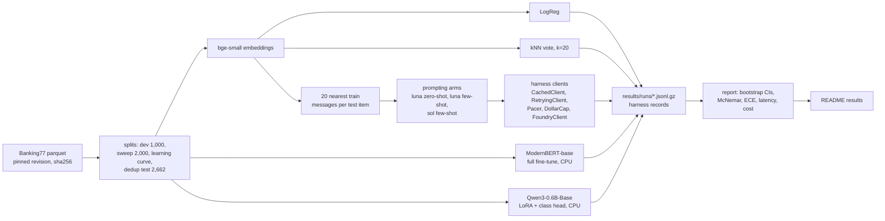

# banking77-lora-vs-frontier

Qwen3-0.6B with LoRA on a 4 vCPU cloud CPU and Qwen3-8B with QLoRA on one GPU, against prompted frontier APIs (gpt-6-luna, gpt-6-sol), all scored on the same 3,080 Banking77 test messages for accuracy, paired significance, latency and cost per 1,000 predictions.

<!-- headline:start -->
- **gpt-6-sol with 20 retrieved examples beats the Qwen3-0.6B LoRA** by 1.2 points (95.0% vs 93.8% on 3,080 test messages, McNemar p=0.001, Holm-adjusted 0.005), at about 20x the per-prediction cost of gpt-6-luna with the same examples. Luna few-shot (p=0.251) and the Qwen3-8B QLoRA (p=0.040, 0.160 after Holm over the secondary pairs) can't be separated from the 0.6B.
- **Logistic regression on frozen bge-small embeddings** costs $0.0010 per 1k predictions, trains in 2 s, and is at most 1.2 points below the 0.6B LoRA (95% CI).
- **A local model is only cheaper than luna few-shot while it stays busy:** above 8.5% utilization for the 0.6B's CPU box and 66.3% for the 8B's A10G. One seed per model and one run per API arm.
<!-- headline:end -->

## Quickstart

```bash
git clone https://github.com/rkemery/banking77-lora-vs-frontier.git && cd banking77-lora-vs-frontier
uv sync --all-extras
make demo
```

`make demo` rebuilds the results below from `results/`, offline and with no keys. `make test` runs the tests. `make baselines` runs the two cheap baselines in a few minutes on a laptop CPU.

<details>
<summary>Running everything</summary>

The long CPU runs and the paid API runs are separate targets, so they can run in the background and resume.

```bash
make data splits          # download and hash-check Banking77, rebuild the frozen splits
make embed baselines      # bge-small embeddings, logistic regression, kNN, logreg learning curve
make timing               # measure this CPU, write results/timing.json and the time estimates
make smoke                # short LoRA and ModernBERT runs scored on dev
make dry-runs             # every long target for 3 steps on a few items, a few minutes
make sweep                # LoRA learning-rate sweep on dev
make train-final          # LoRA on all of train with the sweep's learning rate, scored on test
make train-modernbert     # ModernBERT-base on all of train, scored on test
make learning-curve       # LoRA at 5, 10 and 20 examples per class
make prompt-luna-zeroshot prompt-luna-fewshot prompt-sol-fewshot   # live, needs the Azure variables
make demo                 # rebuild the results section
```

PyTorch slows down badly when its threads compete with another CPU-heavy process (bge-small embedded 67 messages/s on 2 threads and 19 on 4 next to another 3-thread job). On a shared machine, set `OMP_NUM_THREADS` to the number of free cores, for example `OMP_NUM_THREADS=2 make sweep`. Every run file records the thread count and the load average.

The live targets need `AZURE_OPENAI_BASE_URL` and either `AZURE_OPENAI_API_KEY` or an Entra ID sign-in. Export the variables in your shell (see `.env.example`), since nothing loads `.env` for you. Responses are cached under `cache/llm/` (not committed), so an interrupted run resumes for free. To check the plumbing first, `uv run b77 prompt --arm luna-zeroshot --live --cap 0.05 --limit 20` classifies the first 20 messages.

</details>

## Results

`make demo` rebuilds this section and the bullets above from the run files in `results/`.

<!-- results:start -->
| Arm | Accuracy (95% CI) | Macro-F1 (95% CI) | Accuracy, dedup test (n=2,662) | ECE | Latency p50 / p95 | Cost per 1k predictions |
|---|---|---|---|---|---|---|
| LogReg on bge-small embeddings | 93.4% (92.5 to 94.3) | 93.4% (92.4 to 94.2) | 92.6% (91.5 to 93.5) | 0.104 | 17 / 26 ms (CPU, batch 1) | $0.0010 |
| kNN vote over the same 20 retrieved neighbours | 92.2% (91.3 to 93.2) | 92.2% (91.2 to 93.1) | 91.3% (90.2 to 92.4) | 0.039 | 19 / 27 ms (CPU, batch 1) | $0.0011 |
| ModernBERT-base, full fine-tune | 93.9% (93.0 to 94.7) | 93.9% (92.9 to 94.7) | 93.1% (92.0 to 94.0) | 0.020 | 52 / 59 ms (CPU, batch 1) | $0.0030 |
| Qwen3-0.6B-Base + LoRA r16, classification head | 93.8% (93.0 to 94.6) | 93.8% (92.9 to 94.6) | 92.9% (92.0 to 93.9) | 0.031 | 105 / 131 ms (CPU, batch 1) | $0.0061 |
| gpt-6-luna zero-shot, label descriptions | 85.5% (84.2 to 86.7) | 85.1% (83.7 to 86.2) | 84.5% (83.1 to 85.8) | n/a (no logprobs) | 1339 / 3220 ms | $0.0272 |
| gpt-6-luna, 20 retrieved examples | 94.3% (93.5 to 95.1) | 94.3% (93.4 to 95.0) | 93.6% (92.6 to 94.5) | n/a (no logprobs) | 1358 / 3339 ms | $0.0713 |
| gpt-6-sol, 20 retrieved examples | 95.0% (94.3 to 95.8) | 95.0% (94.2 to 95.7) | 94.3% (93.4 to 95.2) | n/a (no logprobs) | 1704 / 3589 ms | $1.43 |
| Qwen3-8B-Base QLoRA r16 (one A10G, Hugging Face Jobs) | 94.6% (93.8 to 95.4) | 94.6% (93.7 to 95.3) | 93.9% (93.0 to 94.7) | 0.026 | 112 / 124 ms (A10G GPU, batch 1) | $0.0473 |

n = 3,080 test items (40 per class) for every row, with 95% percentile bootstrap CIs over items. The dedup column drops the 418 test items whose nearest training message has the same label at character n-gram cosine >= 0.90.

Every arm scores 0.7 to 1.0 points lower on the dedup subset. That includes `gpt-6-luna-zeroshot` (1.0), which has no training messages in its prompt, so the dropped twins are mostly easier messages, not answers the fine-tuned models memorised.

**Break-even utilization.** A rented box costs the same per hour busy or idle, and the API bills per call. So a local arm is only cheaper while its box is busy for more than (local cost / API cost) of the time, training excluded.

| Local arm | Cost per 1k, fully busy | API arm | Cost per 1k | Local is cheaper |
|---|---|---|---|---|
| qwen3-0.6b-lora-r16-s0 (CPU) | $0.0061 | gpt-6-luna-fewshot-k20 | $0.0713 | above 8.5% utilization |
| qwen3-0.6b-lora-r16-s0 (CPU) | $0.0061 | gpt-6-sol-fewshot-k20 | $1.43 | above 0.4% utilization |
| qwen3-8b-qlora-r16-s0 (A10G) | $0.0473 | gpt-6-luna-fewshot-k20 | $0.0713 | above 66.3% utilization |
| qwen3-8b-qlora-r16-s0 (A10G) | $0.0473 | gpt-6-sol-fewshot-k20 | $1.43 | above 3.3% utilization |

**Paired comparisons** on the same 3,080 items (accuracy, candidate minus baseline). CI from a paired bootstrap, p from the exact McNemar test, MDE is the smallest difference this pair could detect with 80% power (harness `stats`). Holm p is over the primary family, {0.6B LoRA, 8B QLoRA} x {luna few-shot, sol few-shot}, named after the results were in. Every fine-tune here has one seed and every API arm ran once, so seed-to-seed and run-to-run variance isn't in these CIs.

| Baseline | Candidate | Baseline acc. | Candidate acc. | Difference (95% CI) | McNemar p | Discordant (base only / cand. only) | MDE | n | Family (Holm p) |
|---|---|---|---|---|---|---|---|---|---|
| qwen3-0.6b-lora-r16-s0 | gpt-6-luna-fewshot-k20 | 93.8% | 94.3% | +0.5 pts (-0.3 to +1.3) | 0.251 | 67 / 82 | 1.1 pts | 3,080 | primary (0.724) |
| qwen3-0.6b-lora-r16-s0 | gpt-6-sol-fewshot-k20 | 93.8% | 95.0% | +1.2 pts (+0.5 to +1.9) | 0.001 | 45 / 82 | 1.0 pts | 3,080 | primary (0.005) |
| qwen3-8b-qlora-r16-s0 | gpt-6-luna-fewshot-k20 | 94.6% | 94.3% | -0.3 pts (-1.0 to +0.4) | 0.467 | 65 / 56 | 1.0 pts | 3,080 | primary (0.724) |
| qwen3-8b-qlora-r16-s0 | gpt-6-sol-fewshot-k20 | 94.6% | 95.0% | +0.4 pts (-0.2 to +1.1) | 0.241 | 46 / 59 | 1.0 pts | 3,080 | primary (0.724) |

<details>
<summary>Secondary pairs (unadjusted p)</summary>

| Baseline | Candidate | Baseline acc. | Candidate acc. | Difference (95% CI) | McNemar p | Discordant (base only / cand. only) | MDE | n | Family (Holm p) |
|---|---|---|---|---|---|---|---|---|---|
| logreg-bge-small | knn-bge-small-k20 | 93.4% | 92.2% | -1.2 pts (-1.9 to -0.5) | 0.002 | 83 / 47 | 1.1 pts | 3,080 | secondary |
| logreg-bge-small | modernbert-base-full | 93.4% | 93.9% | +0.5 pts (-0.3 to +1.2) | 0.238 | 63 / 78 | 1.1 pts | 3,080 | secondary |
| logreg-bge-small | qwen3-0.6b-lora-r16-s0 | 93.4% | 93.8% | +0.4 pts (-0.4 to +1.2) | 0.338 | 72 / 85 | 1.2 pts | 3,080 | secondary |
| logreg-bge-small | qwen3-8b-qlora-r16-s0 | 93.4% | 94.6% | +1.2 pts (+0.5 to +1.9) | 0.002 | 48 / 85 | 1.1 pts | 3,080 | secondary |
| modernbert-base-full | qwen3-0.6b-lora-r16-s0 | 93.9% | 93.8% | -0.1 pts (-0.8 to +0.7) | 0.934 | 74 / 72 | 1.1 pts | 3,080 | secondary |
| qwen3-0.6b-lora-r16-s0 | qwen3-8b-qlora-r16-s0 | 93.8% | 94.6% | +0.8 pts (+0.1 to +1.5) | 0.040 | 51 / 75 | 1.0 pts | 3,080 | secondary |
| qwen3-0.6b-lora-r16-s0 | gpt-6-luna-zeroshot | 93.8% | 85.5% | -8.3 pts (-9.6 to -7.1) | <0.001 | 325 / 68 | 1.8 pts | 3,080 | secondary |
| qwen3-8b-qlora-r16-s0 | gpt-6-luna-zeroshot | 94.6% | 85.5% | -9.1 pts (-10.3 to -8.0) | <0.001 | 322 / 41 | 1.8 pts | 3,080 | secondary |
| knn-bge-small-k20 | gpt-6-luna-fewshot-k20 | 92.2% | 94.3% | +2.1 pts (+1.3 to +2.9) | <0.001 | 50 / 114 | 1.2 pts | 3,080 | secondary |
| gpt-6-luna-zeroshot | gpt-6-luna-fewshot-k20 | 85.5% | 94.3% | +8.8 pts (+7.8 to +9.9) | <0.001 | 15 / 287 | 1.6 pts | 3,080 | secondary |
| gpt-6-luna-fewshot-k20 | gpt-6-sol-fewshot-k20 | 94.3% | 95.0% | +0.7 pts (+0.2 to +1.2) | 0.008 | 21 / 43 | 0.7 pts | 3,080 | secondary |

Holm over all 15 pairs at once gives the primary pairs qwen3-0.6b-lora-r16-s0 vs gpt-6-luna-fewshot-k20 1.000, qwen3-0.6b-lora-r16-s0 vs gpt-6-sol-fewshot-k20 0.014, qwen3-8b-qlora-r16-s0 vs gpt-6-luna-fewshot-k20 1.000, qwen3-8b-qlora-r16-s0 vs gpt-6-sol-fewshot-k20 1.000. The same pairs clear 0.05 either way, so the conclusions don't depend on which family is named. sol over luna few-shot (p=0.008) is suggestive only: Holm gives 0.041 over the secondary pairs and 0.065 over all of them.

</details>

<details>
<summary>Cost and latency assumptions, one-off spend</summary>

ECE is top-label expected calibration error with 15 bins (the kNN row's confidence is its winning vote share, not a probability). API latency is one request over the network and API cost is from measured token usage at list price. Local CPU cost assumes one Azure D4s v6 VM (4 vCPU, 16 GiB, 5th gen Xeon with AMX, the same CPU class these runs used) at the $0.202/hour Linux pay-as-you-go list price in East US 2 (Azure Retail Prices API, 2026-09-28), serving one message at a time with no batching and no idle time. The GPU row uses the Hugging Face Jobs a10g-large list price its run recorded ($1.50/hour, huggingface.co/docs/hub/jobs-pricing, 2026-09-28) on the same one-message-at-a-time basis.

Local latency depends on how busy the machine was (load 4 means all 4 vCPUs busy, and the D4s v6 has 2 physical cores under them): `logreg-bge-small` with 1 torch thread(s) at load 6.91, `knn-bge-small-k20` with 1 torch thread(s) at load 6.91, `modernbert-base-full` with 2 torch thread(s) at load 2.01, `qwen3-0.6b-lora-r16-s0` with 2 torch thread(s) at load 2.0. `logreg-bge-small` and `knn-bge-small-k20` were timed on a shared machine with more work queued than it had vCPUs, not the idle D4s v6, but priced at the D4s v6 rate, so their latency and cost are upper bounds.

| Run | One-off cost | What it paid for |
|---|---|---|
| logreg-bge-small | $0.0001 | training, 2 seconds on the CPU at the VM price |
| modernbert-base-full | $0.0491 | training, 14.6 minutes on the CPU at the VM price |
| qwen3-0.6b-lora-r16-s0 | $0.0785 | training, 23.3 minutes on the CPU at the VM price |
| gpt-6-luna-zeroshot | $0.08 | 3,080 calls at list price, 0 failed, 0 invalid labels |
| gpt-6-luna-fewshot-k20 | $0.22 | 3,080 calls at list price, 0 failed, 0 invalid labels |
| gpt-6-sol-fewshot-k20 | $4.40 | 3,080 calls at list price, 0 failed, 0 invalid labels |
| qwen3-8b-qlora-r16-s0 | $0.5513 | training, 22.1 minutes on one A10G at the job's list price |

</details>

<details>
<summary>Learning curve, learning-rate sweep and CPU timing</summary>

**Learning curve** (accuracy on the full test set). Subsets are nested across k and drawn from train minus dev. The LoRA curve runs train for 10 epochs at the sweep's learning rate, the full-data run for 2. See What didn't work for why this curve can't test the small-data claim.

| Examples per class | Train size | LogReg on bge-small (mean of 3 draws, sd) | Qwen3-0.6B LoRA (draw 0) |
|---|---|---|---|
| 5 | 385 | 83.3% (sd 0.5) | 61.6% |
| 10 | 770 | 87.3% (sd 1.0) | 79.3% |
| 20 | 1,540 | 89.3% (sd 0.4) | 86.9% |
| all (about 130) | 10,003 | 93.4% (one fit) | 93.8% |

LoRA learning-rate sweep on the 2,000-example stratified subset, one seed, scored on the 1,000-item dev split. Chosen: 0.0003.

| Learning rate | Dev accuracy by epoch | Train minutes |
|---|---|---|
| 0.0001 | 59.7%, 79.5% | 4.7 |
| 0.0003 | 77.6%, 86.2% | 4.7 |

Measured on INTEL(R) XEON(R) PLATINUM 8573C (2 threads, torch 2.14.0+cpu), load average 1.68 before and 1.79 after (4 means all 4 vCPUs busy):

| Model | Training examples/s | Inference, batch 1 (p50) | Inference, batch 64 |
|---|---|---|---|
| Qwen3-0.6B-Base + LoRA (bs 16) | 12.9 | 102 ms unmerged, 74 ms merged | 31/s |
| ModernBERT-base (bs 32) | 32.9 | 55 ms | 121/s |
| bge-small encoder | n/a (frozen) | 8 ms | 177/s |

Estimated wall-clock for the long targets: `make sweep` 14 min, `make train-final` 32 min per seed, `make train-modernbert` 19 min, `make learning-curve` 41 min.

</details>
<!-- results:end -->

## Method

| What | How |
|---|---|
| Accuracy and macro-F1 | All 3,080 test messages (40 per intent), with 95% percentile bootstrap CIs over items. Macro-F1 also catches a model that dumps messages into a few intents. |
| Dedup accuracy | Drops test messages whose nearest training message has the same label at character 3 to 5 gram TF-IDF cosine >= 0.90 (the ank018/lora-banking77 method), so a fine-tune can't score by recall. |
| Label budget | The fine-tunes, LogReg and kNN train on all 10,003 training messages, and the few-shot arms retrieve from the same 10,003. The zero-shot arm's intent descriptions were written from the label names and a few training examples per label (`src/b77/labels.py`). |
| Paired tests | Every arm answers the same items. Paired bootstrap CI on the difference, exact McNemar p and minimum detectable effect, all from the harness `stats` module. |
| Calibration (ECE) | Local models only, since gpt-6 deployments reject `logprobs`. |
| Latency p50 / p95 | Local models one message at a time on the CPU they trained on. API arms per request over the network. |
| Cost per 1,000 predictions | API arms: measured token usage at list price, cached input at the cached rate. Local arms: CPU time at a comparable cloud VM's list price. Training cost is separate. |
| Learning curve | 5, 10 and 20 examples per class, LogReg over three draws and the 0.6B LoRA on one. See [What didn't work](#what-didnt-work). |

[ank018/lora-banking77](https://github.com/ank018/lora-banking77) already ran the local side of this comparison carefully, and on the same test set the LogReg row here is within a point of its fine-tuned roberta-base (94.0%). This repo adds the frontier-API side, with measured cost and latency, paired tests against the local models, and a classification-head LoRA small enough for a 4-core CPU.

<details>
<summary>Prior work in more detail</summary>

Numbers checked against ank018's README and stage docs on 2026-09-28: generative LoRA on Qwen3-1.7B reached 93.6% (seed sd 0.26 pts) against 94.0% (sd 0.23) for a full fine-tune of roberta-base at 9,387 training messages (p = 0.12, not significant). The LoRA model led by 8.9 points at 154 messages (2 per class), and the crossover sat between 308 and 616 messages. It also found that 13.8% of test messages have a same-label near twin in its training pool, and that the full-vs-clean gap shrank with more data and appeared for zero-shot too, so it tracked easy messages rather than memorisation. This repo finds the same pattern against all 10,003 training messages. Near twins with a different label stay in the dedup subset, as a small direct view of label noise.

</details>

<details>
<summary>What's inside</summary>

| Path | What it does |
|---|---|
| `src/b77/data.py` | Downloads the pinned Banking77 parquet files and checks their sha256 on every load. |
| `src/b77/splits.py`, `dedup.py` | Stratified dev split, sweep subset, nested learning-curve subsets, and the near-duplicate scan behind the deduplicated test subset. Written once to `data/splits/`. |
| `src/b77/embed.py`, `baselines.py` | Frozen bge-small embeddings, logistic regression with C picked on dev, and a kNN vote over the retrieved neighbours. |
| `src/b77/train.py` | CPU training loop: LoRA on Qwen3-0.6B-Base with a classification head, full fine-tune of ModernBERT-base, bf16 autocast, length-grouped batches. |
| `src/b77/prompting.py` | The three prompting arms (zero-shot and retrieval-augmented few-shot), the shared cacheable prefix, the JSON-schema label enum and a tokens-per-minute pacer. Calls go through the harness `CachedClient`, `RetryingClient` and `DollarCap`. |
| `src/b77/metrics.py`, `report.py` | Accuracy and macro-F1 with bootstrap CIs, calibration error, latency percentiles, paired McNemar tests through the harness, and this README's results section. |
| `src/b77/timing.py`, `plan.py`, `estimate.py` | Measured CPU throughput, the hyperparameters in one place, and the time and dollar estimates for the long runs. |
| `results/runs/` | One gzip-compressed JSONL file per run in the [llm-eval-harness](https://github.com/rkemery/llm-eval-harness) results format (one record per test item, `zcat` it into any `llm-eval` command), plus a `.info.json` saying what produced it. |
| `scripts/hf_job_qwen3_8b_qlora.py`, `scripts/launch_hf_job.py` | Qwen3-8B-Base QLoRA on one A10G as a Hugging Face Job (a uv script with its own dependencies), and the launcher that starts it with a timeout as the spending cap and fetches the results. |
| `notebooks/qwen3_8b_qlora_colab.ipynb` | The same 8B recipe for a free Colab T4 (fp16). Not run. The 8B row comes from the Hugging Face Job. |



</details>

## Design decisions

| Decision | Why |
|---|---|
| A classification head, not generation | One forward pass per message, no output parsing, and real probabilities for calibration. |
| LoRA settings from "LoRA Without Regret" | Adapters on every linear layer, rank 16 with alpha 32, batch 16, and a learning rate about 10x full fine-tuning's. |
| Qwen3-0.6B-Base | A text-only base model small enough to train on 4 CPU cores. |
| ModernBERT-base | The fine-tuned encoder baseline, at settings inside its authors' GLUE grid. |
| Qwen3-8B-Base with QLoRA on a rented A10G | An 8B model won't train on 4 CPU cores in any useful time. |
| bge-small | Frozen-embedding baseline and retrieval, from one set of embeddings. |
| Retrieval-augmented prompting, 20 examples | The kNN row votes over the same 20 neighbours, which shows what the LLM adds. |
| One static prefix for every prompt | The provider's prompt cache bills it at the cached rate. |
| Structured outputs | A strict JSON-schema enum of the 77 names forces a valid label. |
| Harness clients for every call | Cached reruns, retries, a tokens-per-minute pacer and a hard dollar cap. |
| Dev from train, never test | Test is scored once per final config. |
| Latency with the adapter unmerged | The reported numbers use the model exactly as trained. |
| No RL fine-tuning | One verifiable label per message is already full supervision. |

<details>
<summary>Details and sources</summary>

- **A classification head, not generation.** The LoRA model reads the message and a linear head over the last token's hidden state scores the 77 intents (`AutoModelForSequenceClassification`, PEFT `task_type=SEQ_CLS`). ank018/lora-banking77 trained generative LoRA and found output formatting took thousands of examples to learn.
- **LoRA settings from "LoRA Without Regret"** (Schulman and Thinking Machines Lab, 2025, [thinkingmachines.ai/blog/lora](https://thinkingmachines.ai/blog/lora/)): adapters on every linear layer including the MLP (attention-only LoRA underperforms), rank 16 with alpha 32 (the 1/r scaling makes the best learning rate nearly independent of rank), batch size 16 (LoRA pays more than full fine-tuning for large batches), and a learning rate about 10x what full fine-tuning would use. The sweep tries 1e-4 and 3e-4, 10x the usual 1e-5 to 3e-5 range, on a 2,000-message stratified subset with one seed, and picks by dev accuracy. LoRA itself is Hu et al. 2021 ([arXiv 2106.09685](https://arxiv.org/abs/2106.09685)).
- **Qwen3-0.6B-Base** (Qwen3 Technical Report, [arXiv 2505.09388](https://arxiv.org/abs/2505.09388)). The frozen base stays in bf16 and the adapters and head train in fp32 under bf16 autocast, the fastest option measured on this CPU (it has AMX).
- **ModernBERT-base** (Warner et al. 2024, [arXiv 2412.13663](https://arxiv.org/abs/2412.13663)) at lr 5e-5 for 3 epochs, both inside the grid its authors swept for GLUE. Not swept here.
- **Qwen3-8B-Base with QLoRA** ran once as a Hugging Face Job on one A10G (24 GB). The frozen base is quantised to 4-bit NF4 (QLoRA, Dettmers et al. 2023, [arXiv 2305.14314](https://arxiv.org/abs/2305.14314)), with the same r16 alpha 32 adapters on every linear layer, the same classification head, 2 epochs and the 0.6B sweep's learning rate. The job's timeout is its spending cap (flavor price x timeout). Its training time and cost are in the one-off spend table. Two differences from the CPU recipe: batches come in random order rather than length-grouped, and the job downloads the pinned parquet revision without the sha256 check the CPU runs do.
- **bge-small** (Xiao et al., C-Pack, [arXiv 2309.07597](https://arxiv.org/abs/2309.07597)) with CLS pooling and no instruction prefix, since message-to-message similarity is symmetric.
- **Retrieval-augmented prompting** (Liu et al. 2021, [arXiv 2101.06804](https://arxiv.org/abs/2101.06804)): the few-shot arms put the 20 most similar training messages in the prompt with their labels, most similar last. The neighbours come from the same bge-small embeddings as the LogReg and kNN rows, so these arms are retrieval plus an LLM, not prompting alone. The kNN vs luna few-shot row in the secondary pairs shows how much the LLM adds beyond copying its examples.
- **One static prefix for every prompt.** Instructions and all 77 intents with a one-line description come first and never change, then the examples and the message. Everything before the user turn is byte-identical across calls and arms. The intent descriptions were written once from the label names and training messages and never tuned on dev or test.
- **Structured outputs.** Reasoning effort is `none` and `max_output_tokens` is 32. Parsing still checks the reply and counts anything else as wrong.
- **Harness clients for every call.** `CachedClient` outermost (reruns are free and resume after an interruption), `RetryingClient` with backoff, a pacer that keeps requests under the deployment's tokens-per-minute limit, and `DollarCap` next to the model, which refuses any call that could take spend past the cap. The pacer exists because a rate-limited attempt still counts its worst case against the cap.
- **Dev from train, never test.** A stratified 1,000-message dev split picks the LoRA learning rate and the logistic-regression C. Final models are refit on all 10,003 training messages with those settings and a fixed number of epochs.
- **Latency at batch size 1 with the adapter unmerged.** Merging the LoRA weights into the bf16 base cut single-message latency sharply in the timing run, but rounds the update into bf16 weights.
- **No RL fine-tuning.** Every message has one verifiable label, so supervised fine-tuning already gets the full signal from each example, while policy-gradient RL gets on the order of one bit per episode (the same "LoRA Without Regret" post makes this argument).

</details>

## What didn't work

The learning curve was meant to test whether an LLM's prior knowledge helps most with few examples. It can't, because this LoRA's randomly initialised 77-way head never sees the label names, and the "all" row uses a different recipe (2 epochs instead of 10).

| Tried | What happened | Now |
|---|---|---|
| Random batches | The first timing run spent a large share of its compute on padding. | Length-grouped batches: shuffle, sort within chunks of 50 batches, shuffle the batches. |
| sdpa attention for ModernBERT on CPU | 11.6 examples/s against 14.7 for eager at batch 32, in the exploratory timing. | Eager attention. |
| An fp32 frozen base under autocast for the LoRA model | About 9% slower than a bf16 base, and twice the memory. | bf16 base. |
| A LogReg C grid that stopped at 100 | Two learning-curve fits picked C = 100, the edge of the grid. | The grid reaches 1,000. One fit (20 per class, draw 2) then picked 1,000, only 0.3 dev points above C = 100. The full-data fit picks 10. |
| Casting the fine-tuned ModernBERT to bf16 for inference | `.to(torch.bfloat16)` also rounds buffers, and the cast model disagreed with the same checkpoint reloaded from disk. | Full fine-tunes predict with fp32 weights under bf16 autocast. A reloaded checkpoint matches to within 5e-6 in probability. |
| ModernBERT's `reference_compile` flag | transformers 5 removed it, so the first load failed. | The model runs uncompiled. |
| Timing on a shared machine | Oversubscribed CPU threads slowed PyTorch far more than the load alone suggests. | Long runs and the timing table redone on an idle Azure D4s v6. The LogReg and kNN latencies are still from the loaded machine, so they and their costs are upper bounds. |

<details>
<summary>The learning curve in more detail</summary>

ank018/lora-banking77 found its generative LoRA led a fine-tuned roberta-base by 8.9 points at 2 per class. That LoRA generated the label names, so it could use what the model already knows about them. This repo's LoRA feeds a randomly initialised 77-way classification head, and it's compared with logistic regression on bge-small embeddings, which already put similar messages close together. In this design the LoRA trails LogReg at every small k (see the learning-curve table under Results).

It doesn't look like an optimiser problem. The sweep (2,000 messages x 2 epochs) and the 5-per-class run (385 x 10 epochs) both took 250 steps at lr 3e-4 on the same schedule, and the sweep reached a far higher dev accuracy, so the gap comes from having less data. The curve runs logged no dev accuracy, so there's no evidence either way on overfitting, only a train loss below 1e-3 from step 175.

The label-name prior does show up elsewhere: luna zero-shot, with no examples in the prompt, scores above the LoRA at 5 and 10 per class and above LogReg at 5.

</details>

## Limitations

- **Label noise.** Ying and Thomas (2022, [Insights from Negative Results in NLP](https://aclanthology.org/2022.insights-1.19/)) flagged over 1,400 of the 10,003 training messages (14%) as possibly mislabelled, using automated methods. The test set likely has similar noise, which caps every arm below 100% and blurs differences between strong arms.
- **Contamination.** Banking77 has been public since 2020, test split included, and the gpt-6 models may have seen it in training. The dedup subset guards against train-test overlap for fine-tuned models, not against a hosted model having memorised the test set.
- **One seed or run per arm.** The paired CIs and p-values hold each fine-tune and API run fixed, so gaps under a point (0.6B vs 8B, for one) could move with another seed. `make train-final SEED=1` adds a 0.6B seed, and the table then shows the spread.
- **Local cost is an assumption:** serial batch-1 inference at list price with no idle time. The break-even table shows how much idle time each local arm can carry before the API is cheaper.

<details>
<summary>More limitations</summary>

- **No labels corrected or written by hand.** This repo uses no human labels of its own.
- **The learning-curve LoRA runs use one draw** of the training subset. The LogReg curve uses three.
- **The sweep is small.** Two learning rates, one seed, a 2,000-message subset, chosen by dev accuracy. It picked 3e-4, the top of a two-point grid, so a higher rate might do better. The 8B reused that rate without a sweep of its own. Epoch counts are fixed in advance rather than tuned, to fit the CPU budget.
- **No calibration for the API arms** (no logprobs), and API latency includes the network and the provider's queue on the day of the run.
- **Batching and GPUs change the local cost.** Batching raises throughput several times.
- **The 8B row ran on a GPU, the other local rows on a CPU.** Its latency and cost use the A10G and the job's list price, so compare them with the CPU rows as a different deployment, not a like-for-like speed test.
- **Two PyTorch threads.** The D4s v6 has 4 vCPUs on 2 physical cores, and PyTorch 2.14 used 2 threads (one per core) even with `OMP_NUM_THREADS=4`. Every CPU number here is at 2 threads, as `results/timing.json` and each run's info file record.
- **Token and time estimates for the API arms** use the Qwen3 tokenizer as a stand-in for the provider's, so they are rough (about +/- 25%).

</details>

## Cost

Each API arm runs once on the 3,080 test messages under its own hard cap:

| Target | Model | Hard cap (`DollarCap`) |
|---|---|---|
| `make prompt-luna-zeroshot` | gpt-6-luna | $2 |
| `make prompt-luna-fewshot` | gpt-6-luna | $2 |
| `make prompt-sol-fewshot` | gpt-6-sol | $20 |

Actual spend, including the CPU and A10G training time, is in the one-off spend table under Results.

<details>
<summary>Offline estimate (<code>make estimate</code>)</summary>

<!-- estimate:start -->
Computed 2026-09-28 by `make estimate`. Token counts: Qwen3 tokenizer as a proxy. Static prefix (instructions + schema): about 1,619 tokens, enough to be cached.

| Arm | Tokens in per call | Cost, no cache hits | Cost, prefix cached | Worst case per call (DollarCap) | Default cap | Wall clock at the TPM limit |
|---|---|---|---|---|---|---|
| luna-zeroshot (gpt-6-luna) | 1,634 | $0.52 | $0.08 | $0.0008 | $2.00 | 5.0 h at 20,000 TPM |
| luna-fewshot (gpt-6-luna) | 2,082 | $0.66 | $0.21 | $0.0010 | $2.00 | 6.4 h at 20,000 TPM |
| sol-fewshot (gpt-6-sol) | 2,082 | $13.26 | $4.28 | $0.0191 | $20.00 | 12.8 h at 10,000 TPM |
<!-- estimate:end -->

`make estimate` computes this from the real prompts. The binding limit is time, not money. At the tokens-per-minute capacity the deployments had on 2026-09-28 (luna 20K, sol 10K), the pacer spreads the three arms over roughly 5 to 13 hours. The two luna arms share one deployment, so run them one after the other (each process paces itself and does not know about the other). The sol arm can run at the same time. Raising a deployment's capacity shortens the run without changing any price, and `--tpm` tells the pacer the new limit.

</details>

## How I built this

The code was written with Claude Code as a pair programmer, under my direction and review. The design choices, the scope and every claim in this README are mine to defend.

## License

MIT for the code. Banking77 is CC-BY-4.0 (Casanueva et al. 2020, [arXiv 2003.04807](https://arxiv.org/abs/2003.04807)). See `DATA_SOURCES.md` for every dataset and model revision and its license.
